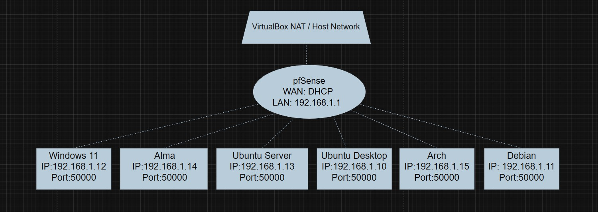

# 🛡️ Virtuelle Netzwerk- & Security-Umgebung (Heimnetzwerk)

## 🗺️ Netzwerkdiagramm

Eine visuelle Übersicht über die gesamte virtuelle Umgebung:

  

## 📌 Projektübersicht

Dieses Projekt zeigt den Aufbau einer virtualisierten Netzwerkumgebung mit mehreren Linux- und Windows-Systemen. Ziel war es, sichere Kommunikation zwischen den Systemen zu ermöglichen sowie Remotezugriffe effizient und praxisnah umzusetzen.

Dabei lag der Fokus auf SSH-Authentifizierung, Netzwerkverständnis und der Nutzung eines modernen VPNs (Tailscale).

---

## 🎯 Ziel des Projekts

- Aufbau einer virtuellen Testumgebung  
- Sichere Verbindung zwischen mehreren Systemen  
- Umsetzung von SSH-Key-basierter Authentifizierung  
- Einrichtung eines einfachen, sicheren Remotezugriffs  
- Verständnis von IP-Strukturen und Netzwerkkommunikation  

---

## 🏗️ Setup

- Virtualisierung: Oracle VM VirtualBox  
- Mehrere virtuelle Maschinen (Linux & Windows)  
- Gemeinsames Netzwerk zur Kommunikation  

---

## 🖥️ Verwendete Systeme

- Debian  
- AlmaLinux  
- Ubuntu Server  
- Ubuntu Desktop  
- Arch Linux  
- Windows 11  

---

## ⚙️ Umsetzung

- Installation mehrerer Betriebssysteme in VirtualBox  
- Aktualisierung aller Systeme auf den neuesten Stand  
- Aufbau einer funktionierenden Netzwerkverbindung zwischen den VMs  
- Einrichtung von Remotezugriffen (SSH & RDP)  

---

## 🔐 SSH-Konfiguration

- Erstellung von SSH-Key-Paaren  
- Verteilung der Public Keys auf Linux-Systeme  
- Passwortlose Anmeldung zwischen Systemen  

Beispiel:
ssh arch

➡️ Direkter Zugriff von Windows 11 auf Arch Linux ohne Passwort

🌐 Netzwerk
Kommunikation zwischen allen Systemen innerhalb der virtuellen Umgebung
Nutzung von Hostnames zur Vereinfachung des Zugriffs

🔗 VPN (Tailscale)
Integration aller Systeme in ein Tailscale-Netzwerk
Automatische Vergabe zusätzlicher IP-Adressen
Zugriff auf Systeme über diese IP-Adressen von überall

Beispiel:
ssh user@100.x.x.x

👤 Autor
Mario Horvat
