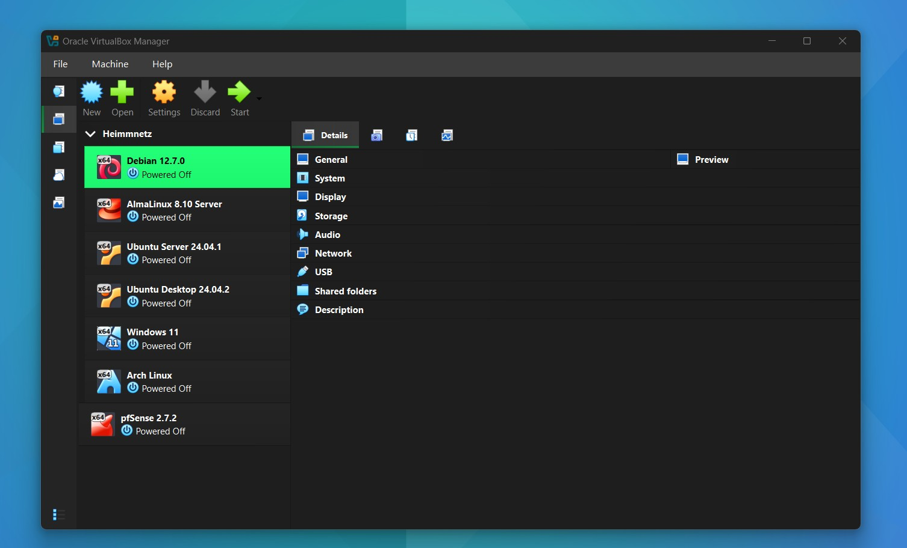

# 🛡️ Virtuelle Netzwerk- & Security-Umgebung (Heimnetzwerk)

## 🗺️ Netzwerkdiagramm

Eine visuelle Übersicht über die gesamte virtuelle Umgebung:

  

## 📌 Projektübersicht

Dieses Projekt zeigt den Aufbau einer virtualisierten Netzwerkumgebung mit mehreren Linux- und Windows-Systemen. Ziel war es, sichere Kommunikation zwischen den Systemen zu ermöglichen sowie Remotezugriffe effizient und praxisnah umzusetzen.

Dabei lag der Fokus auf SSH-Authentifizierung, Netzwerkverständnis und der Nutzung eines modernen VPNs (Tailscale).

---

## 🎯 Ziel des Projekts

- Aufbau einer virtuellen Testumgebung  
- Sichere Verbindung zwischen mehreren Systemen  
- Umsetzung von SSH-Key-basierter Authentifizierung  
- Einrichtung eines einfachen, sicheren Remotezugriffs  
- Verständnis von IP-Strukturen und Netzwerkkommunikation  

---

## 🏗️ Setup

- Virtualisierung: Oracle VM VirtualBox  
- Mehrere virtuelle Maschinen (Linux & Windows)  
- Gemeinsames Netzwerk zur Kommunikation  

---

## 🖥️ Verwendete Systeme

- Debian  
- AlmaLinux  
- Ubuntu Server  
- Ubuntu Desktop  
- Arch Linux  
- Windows 11  

  

---

## ⚙️ Umsetzung

- Installation mehrerer Betriebssysteme in VirtualBox  
- Aktualisierung aller Systeme auf den neuesten Stand  
- Aufbau einer funktionierenden Netzwerkverbindung zwischen den VMs  
- Einrichtung von Remotezugriffen (SSH & RDP)  

---

## 🔐 SSH-Konfiguration

- Erstellung von SSH-Key-Paaren  
- Verteilung der Public Keys auf Linux-Systeme  
- Passwortlose Anmeldung zwischen Systemen  

Beispiel:
ssh arch

➡️ Direkter Zugriff von Windows 11 auf Arch Linux ohne Passwort

  
  

🌐 Netzwerk
Kommunikation zwischen allen Systemen innerhalb der virtuellen Umgebung
Nutzung von Hostnames zur Vereinfachung des Zugriffs

🔗 VPN (Tailscale)
Integration aller Systeme in ein Tailscale-Netzwerk
Automatische Vergabe zusätzlicher IP-Adressen
Zugriff auf Systeme über diese IP-Adressen von überall

Beispiel:
ssh user@100.x.x.x

---

## 🧠 Was ich gelernt habe

Vertieftes Verständnis für virtuelle Netzwerkarchitekturen und die Kommunikation zwischen verschiedenen Betriebssystemen innerhalb einer gemeinsamen Umgebung.

Sichere SSH‑Konfigurationen inklusive Key‑Authentifizierung, Port‑Anpassungen und Hostname‑basiertem Zugriff.

Analyse und Behebung typischer Netzwerkprobleme, z. B. DNS‑Fehler, Routing‑Konflikte, Firewall‑Regeln oder falsche Adaptereinstellungen.

Effiziente Remotezugriffe über SSH, RDP und Tailscale – ohne öffentliche Portfreigaben.

Strukturierter Aufbau einer Laborumgebung, inklusive Dokumentation, Screenshots und Netzwerkdiagrammen.

Praxisnahe Arbeit mit mehreren Linux‑Distributionen, deren Paketverwaltung, Systemdiensten und Benutzerverwaltung.

Grundlagen sicherer Netzwerkarchitektur, wie Segmentierung, Zugriffskontrolle und sichere Kommunikation zwischen Systemen.

Verbesserte Dokumentations‑ und GitHub‑Skills, um technische Projekte nachvollziehbar und professionell aufzubereiten.

👤 Autor
Mario Horvat
